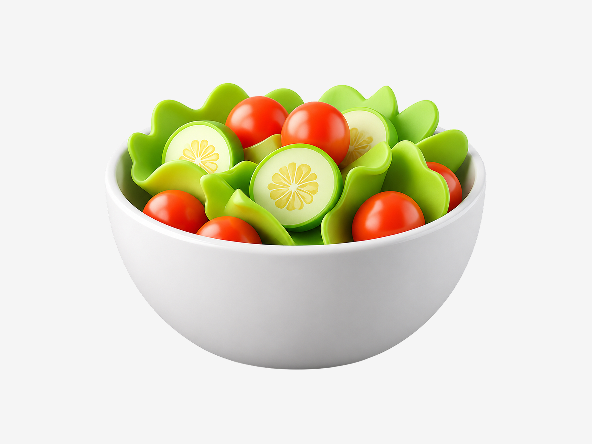
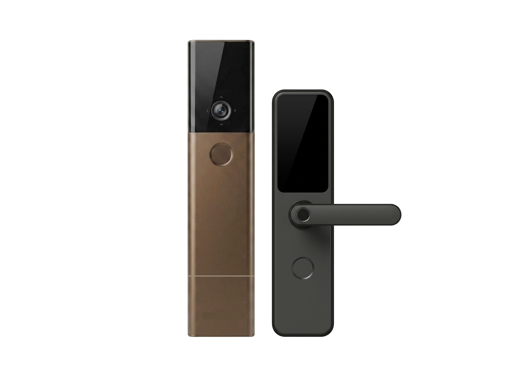
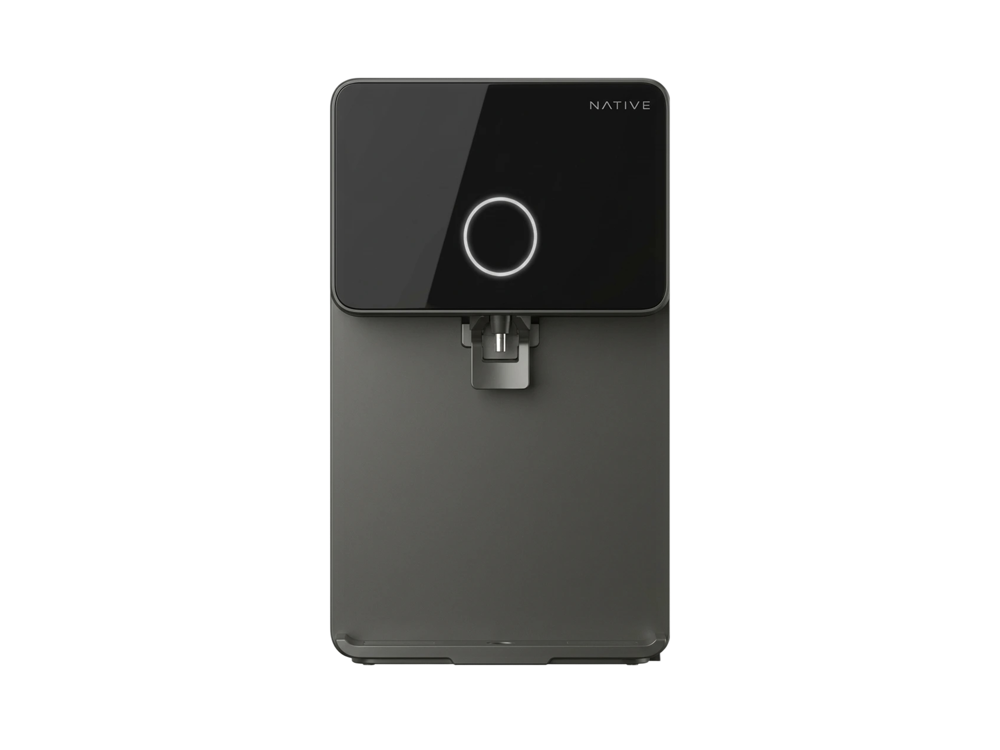
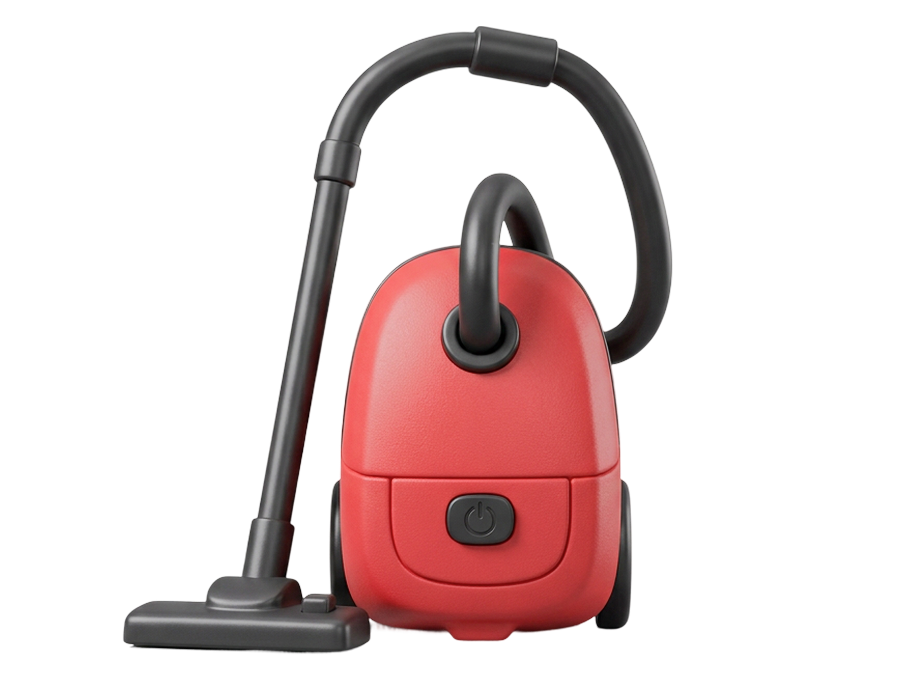

# Icon Skill for Codex

Private working repo for the `uc-icons` Codex skill.

This repository stores the unpacked Codex skill for generating, refining, and exporting Urban Company icons in the new UC tactile skeuomorphic style. It is designed specifically for Codex workflows: the skill relies on Codex skill loading, the companion `imagegen` skill, and GPT Image 2 / Image Gen behavior.

The skill is strongest when paired with visual references and a compact brief. A useful request usually includes the icon subject, the service or material cue, and any details that must remain stable, such as crop, orientation, character identity, or base-object silhouette.

## Capabilities

- Generate new UC-style category icons from image references and a short written direction.
- Edit existing UC icon bases while preserving composition, material finish, crop, lighting, and orientation.
- Export known service icons from bundled archive assets without unnecessary regeneration.
- Build people-centric service icons from canonical character bust bases.
- Fit final outputs proportionally to `1024x768` PNG; composite existing alpha onto UC Grey (`#f5f5f5`) while preserving opaque rendered pixels.

## Use-Case Results

The examples below show the kind of object language this skill is tuned for: clean silhouettes, soft tactile materials, simplified product detail, and consistent presentation on UC Grey (Grey 10).

<table>
  <tr>
    <td align="center"><br><sub>Food and lifestyle objects</sub></td>
    <td align="center"><br><sub>Promotional and reward icons</sub></td>
    <td align="center"><br><sub>Glass, liquid, and transparent materials</sub></td>
  </tr>
  <tr>
    <td align="center"><br><sub>Grouped product sets</sub></td>
    <td align="center"><br><sub>Single premium objects</sub></td>
    <td align="center"><br><sub>Fitness and service category objects</sub></td>
  </tr>
  <tr>
    <td align="center"><br><sub>Native product-style references</sub></td>
    <td align="center"><br><sub>Appliance and device icons</sub></td>
    <td align="center"><br><sub>Beauty and grooming products</sub></td>
  </tr>
  <tr>
    <td align="center"><br><sub>Home service equipment</sub></td>
    <td align="center"><br><sub>Tools and repair cues</sub></td>
    <td align="center"><br><sub>Character bust service icons</sub></td>
  </tr>
  <tr>
    <td align="center"><br><sub>Salon and spa character variants</sub></td>
    <td></td>
    <td></td>
  </tr>
</table>

## Repo Layout

```text
uc-icons/
  SKILL.md                         # Codex skill entrypoint
  agents/openai.yaml               # Codex UI metadata
  scripts/                         # deterministic lookup/export helpers
  references/                      # bundled style, character, and archive assets

examples/use-case-results/         # repo-facing examples for logs and review
```

The installable skill is the `uc-icons/` folder. Top-level files and examples are for human orientation, review, and progress tracking.

## Install

From this repo, install the skill by copying `uc-icons/` into your Codex skills directory:

```bash
mkdir -p "${CODEX_HOME:-$HOME/.codex}/skills"
cp -R uc-icons "${CODEX_HOME:-$HOME/.codex}/skills/uc-icons"
```

Restart Codex after installing or updating the skill.

For a private GitHub install, use the Codex skill installer with credentials that can access this repo:

```bash
python3 install-skill-from-github.py --repo notjignes/icon-skill-for-codex --path uc-icons
```

## Validation

Validate the skill structure:

```bash
python3 quick_validate.py uc-icons
```

Smoke-test archive export from a workspace:

```bash
python3 uc-icons/scripts/export_skeuo_uc_icon.py \
  --subject "native water purifier test" \
  --source "uc-icons/references/archive/PNGs_renamed/Native RO Water Purifiers (India).png" \
  --preserve-source
```

Expected output: a `1024x768` PNG in `./assets/` on UC Grey (Grey 10).

## Notes

- This is not a standalone image-generation app.
- This is not intended for direct use outside Codex.
- Do not replace GPT Image 2 / Image Gen with placeholder SVG, HTML/CSS, or other image models unless explicitly testing a fallback.
- Keep generated output assets outside this repo unless they are deliberately being promoted into the skill archive or example set.
- This repo is private and intended as a personal log/update source before later migration into a shared team repo.

## September 2026 update

The skill now resolves exact exports, compatible base edits, and new objects through one identity-aware planner. Color or material overlap cannot select an unrelated edit base. New object references have explicit form, material, or composition roles; pending references are excluded.

Background cleanup is intentionally absent. Generation requests solid `#f5f5f5`; export only contains the full frame proportionally and composites existing alpha. It never flood-fills, segments pale surfaces, crops by background color, or removes shadows. Background removal remains a separate manual step. The exporter reports the canvas color and an edge-only diagnostic without claiming full-background verification.

```bash
python3 uc-icons/scripts/plan_icon.py --subject "Spa for women" --change "remove towel; upholstery beige"
python3 uc-icons/scripts/validate_reference_bank.py
PYTHONDONTWRITEBYTECODE=1 python3 -m unittest discover -s uc-icons/tests -v
```

The package retains all 72 unique source images and 11 character compatibility copies. The new-object bank is ready for deliberately selected references; it contains no new unreviewed imagery. See `uc-icons/references/reference-library.md` for intake and approval fields. Render-time quality and end-to-end speed still require an image-generation benchmark; local regression tests do not establish those outcomes.
