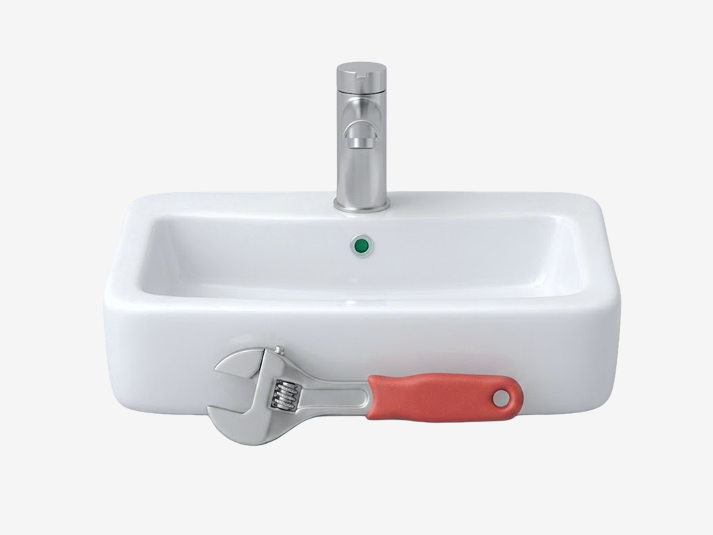
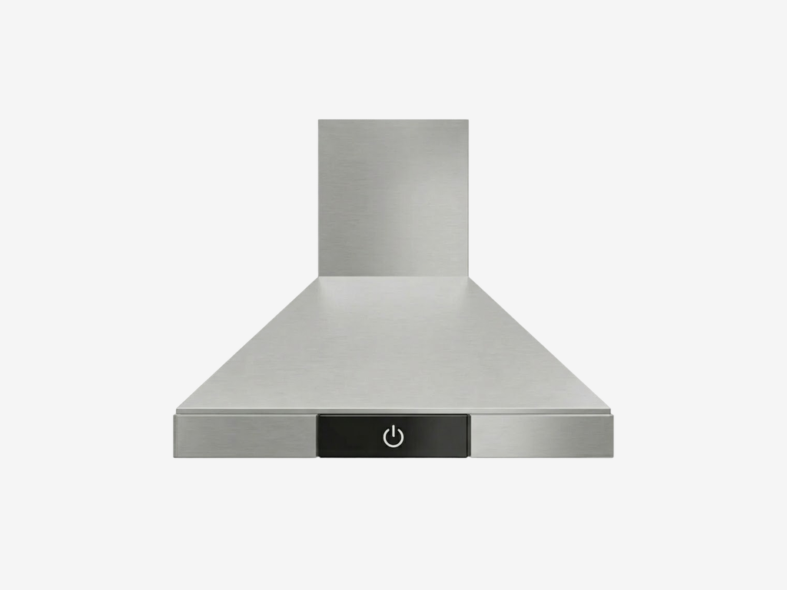
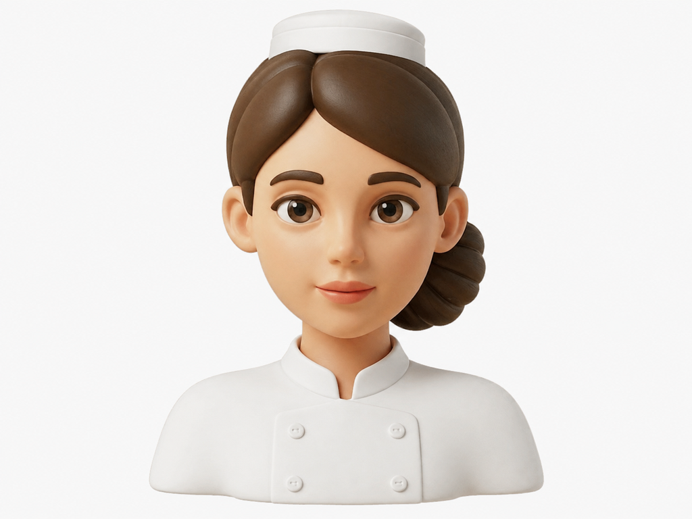

# Corrections after user review

The user rejected both detached-tap concepts. The original **basin and tap assembly with a substantial foreground wrench** is the preferred plumber composition: one semantic fixture, plus one legible repair cue. Its geometry, relative sizing, material and light are restored by exact archive export. The hood is also restored from its archive master. No generation is needed for these two corrections.

| Plumber — restored archive | Hood — restored archive | Chef — selected candidate |
|---|---|---|
|  |  |  |

The selected chef was rebuilt from the user-selected InstaHelp master instead of the warmer generic bare-shoulder base. It follows the low bun, larger face-to-bust ratio and short upper-chest crop. It is the closest current candidate; exact color/identity preservation is not established, the cap margin remains tight, and user approval is still pending. Two subsequent chef edits were not selected because they introduced fresh warmth/shape drift. These limitations are retained rather than counting every returned image as a successful fix.

## Skill fixes

- A fixture’s functional parts count as one semantic item. Secondary tools must remain readable at small sizes, matching approved relative size and overlap.
- Matching form/finish evidence shares one reference. Generic metal terms cannot promote incidental truck chrome; unsupported finishes remain explicit.
- Optional material_scope identifies the actual surface to transfer. Plumber: smooth silver faucet and wrench head with broad highlights, minimal grain; separate glazed ceramic and coral rubber. Hood: quiet fine brushed steel under its own soft light. No blanket matte-to-satin conversion.
- Open-eyed female service variants use the calibrated InstaHelp master. Remove the invented universal head-height ratio and warm-skin language; compare actual skin, light and bust proportions.
- Two generated object references are rejected; only the extractor remains pending. New chef and failed correction renders stay benchmark evidence, not positive library inputs.

## Evidence and limits

59 regression tests and reference/skill validation passed. Archive source PNGs remain unchanged. The two restored exports match deterministic contain/composite results from their archive masters. Every final file is an opaque 1024×768 PNG. No background cleanup was performed.

[Exact prompts, measured tool times and rejected correction outputs](corrections/corrections.json). Full-size source/output comparisons were inspected. The small previews in the review page are for user evaluation; no completed small-size user-recognition test is claimed. This round used four image calls totaling 88.632 seconds, plus two archive exports; it does not establish improved visual acceptance.
